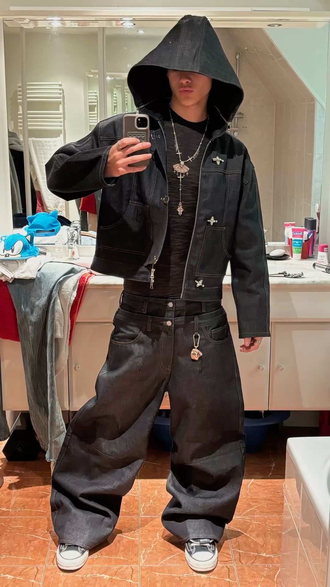

# Proto-persona — YIZU

> Guía: [Proto-persona](../evaluacion/guias/fase-1-requerimientos/02-proto-persona.md)

## Proto-persona principal

Mateo Silva, 22 años. Estudiante de Diseño Gráfico y Creador de Contenido.

"La ropa no es solo para vestirse, es una forma de expresar quién eres sin decir una sola palabra."

### Comportamientos
Pasa gran parte de su tiempo libre en Instagram, TikTok y Pinterest buscando referencias de moda urbana y tendencias streetwear.

Asiste con frecuencia a eventos culturales, festivales de música, exposiciones y reuniones con amigos en zonas céntricas.

Prefiere comprar en línea o en tiendas independientes que ofrecen colecciones limitadas e identidades visuales auténticas.

Saca fotografías de sus outfits para compartirlas en sus redes sociales y busca constantemente prendas con cortes holgados (oversize).

-

### Necesidades
Encontrar prendas de calidad con diseños urbanos auténticos que se diferencien de la moda masiva de tiendas departamentales.

Contar con una experiencia de compra online rápida, visual e intuitiva desde su teléfono móvil.

Acceder a prendas duraderas y cómodas que soporten el uso diario manteniendo la forma del corte y el color.

Sentir pertenencia a una comunidad urbana con la que comparta gustos de música, arte y estilo de vida.
-

### Motivaciones
Construir y proyectar una identidad personal sólida a través de sus combinaciones de ropa.

Apoyar marcas emergentes y locales que aporten valor conceptual a la escena streetwear.

Destacar en su entorno social vistiendo piezas exclusivas o de tiraje limitado.

Inspirar a otros en redes sociales compartiendo su estilo personal.
-

### Frustraciones
Marcas de ropa que venden diseños genéricos a precios elevados sin aportar calidad en las telas ni en las costuras.

Talles inconsistentes y prendas que pierden la forma o el color tras pocos lavados.

Envíos tardíos o falta de información clara sobre el seguimiento del paquete al comprar por internet.

Dificultad para encontrar prendas oversize que tengan una buena caída sin verse descuidadas.
-

<!-- Segunda proto-persona (opcional): copia la estructura de arriba. -->
